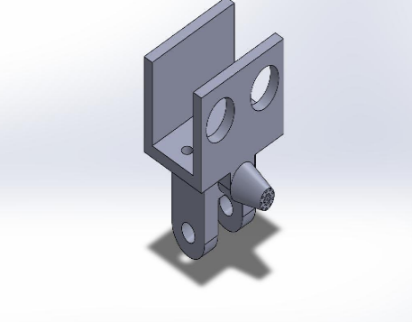
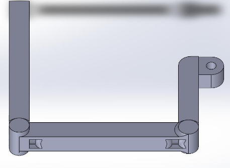
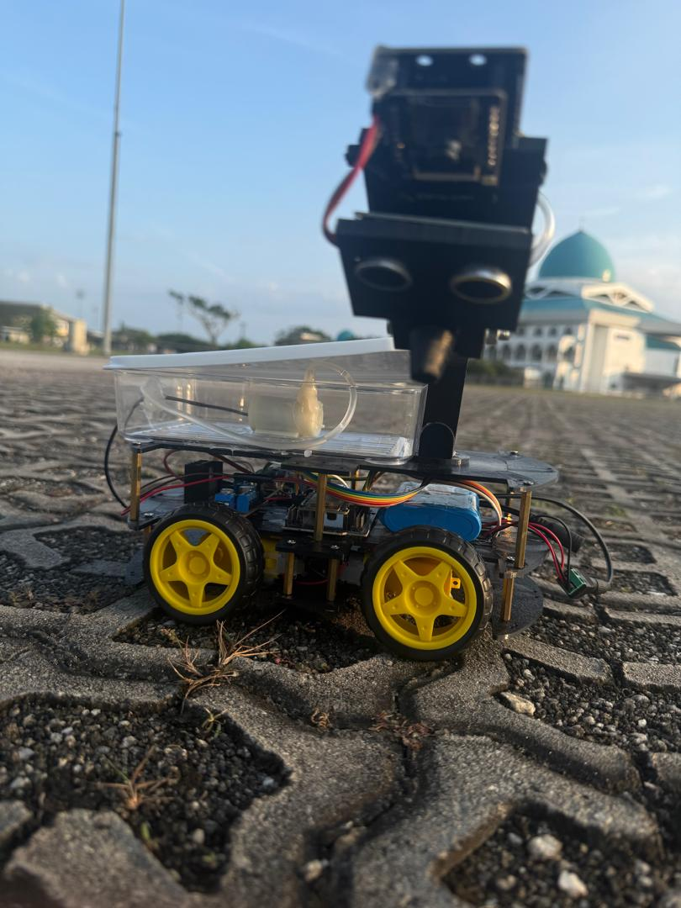
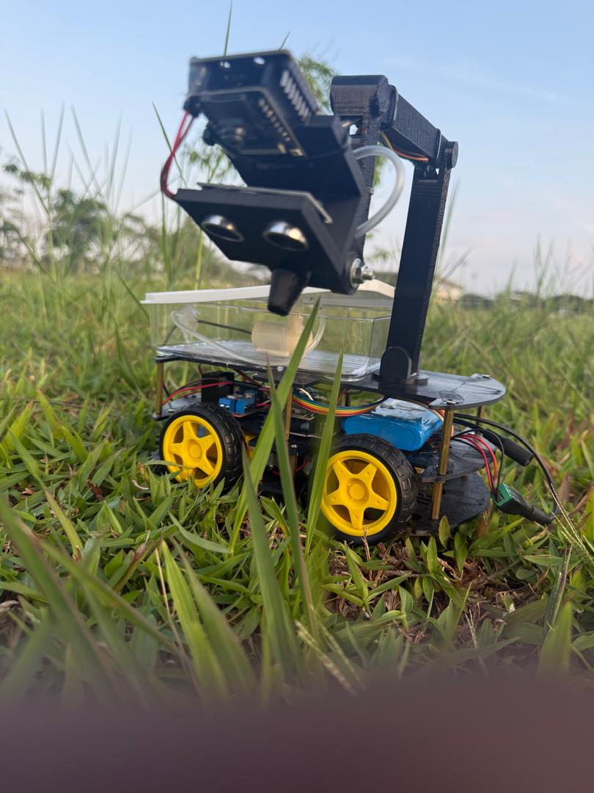

# Beam Agri-Bot | Precision Dosing & Vision System


The **Beam Agri-Bot** is an IoT-enabled mobile platform designed for high-precision agricultural intervention. By combining real-time object detection with targeted chemical dosing, the system minimizes waste and maximizes crop health through intelligent automation.

---

## 🛠 Engineering & 3D Design

The Agri-Bot is built on a modular architecture, with custom-designed 3D components optimized for sensor integration and structural stability.

### Custom 3D Components:
- **Integrated Sensor Handle:** A specialized mount designed to house both the primary vision camera and the ultrasonic distance sensors, ensuring optimal alignment for detection and obstacle avoidance.
- **Actuation Arm (v1):** The current fixed-position arm facilitates targeted liquid delivery to detected plant centers.

| 3D Handle (Camera/Ultrasonic) | 3D Fixed Arm Design |
| :---: | :---: |
|  |  |

---

## 🤖 Evolution & Prototype

The project has moved from a digital-twin phase into physical field testing. The current prototype validates the software-to-hardware triggering loop.

<p align="center">
  
  
</p>

---

## 👁️ Computer Vision System

The system utilizes a **YOLO-World** (Zero-shot) detection engine, allowing the robot to identify specific crops or weeds without extensive localized training.

- **Trigger Logic:** When a plant enters the "Dosing Zone" and is confirmed by the AI, the system calculates the delay and activates the pumps.
- **Monitoring:** Live inference data is relayed to the cloud for performance auditing.

### 🎥 System Demonstration
[https://github.com/user-attachments/assets/c4a1654d-c4e3-4ebb-b27a-4d20b6db65e0](https://github.com/user-attachments/assets/c4a1654d-c4e3-4ebb-b27a-4d20b6db65e0)

---

## ⚠️ Development Roadmap (v2 Transition)

**Note:** The current version of the Agri-Bot serves as a Proof of Concept. Engineering is currently underway to transition the platform from a semi-automated tool to a fully industrial autonomous unit.

### Current Limitations:
The existing **fixed-arm** system, while functional, lacks the dexterity required for diverse crop heights and complex terrain. 

### Future Integration (In Progress):
- **ROS 2 Migration:** Moving the entire control stack to **ROS 2 Humble** for advanced path planning and industrial-grade reliability.
- **Robotic Manipulator (4DOF/6DOF):** Replacing the fixed arm with a multi-axis robotic manipulator to allow for precise leaf-level application and 3D space maneuvering.
- **Enhanced Autonomy:** Transitioning from semi-auto control to full-field autonomous navigation using LiDAR and GPS.

---

## 🌐 Beam Robotics Integration

The Agri-Bot is a core product within the **Beam Robotics Ecosystem**. 

- **Secure Pairing:** Each unit is registered via a cryptographic serial key to the [Beam Command Center](https://github.com/xaatim/Beam-Command-Center).
- **Centralized Dashboard:** Monitor dosing logs, chemical levels, and battery health remotely through the Beam user portal.

---

## 🚀 Installation & Usage

1. **Hardware:** Flash the `firmware/` directory to your ESP32/Arduino.
2. **Software:** ```bash
pip install ultralytics socketio-client opencv-python
python agri_vision_main.py


---

## Contributor

**Hatim Ahmed Hassan** *Lead Architect & Co-Founder, Beam Robotics*

## License

Licensed under the MIT License.

